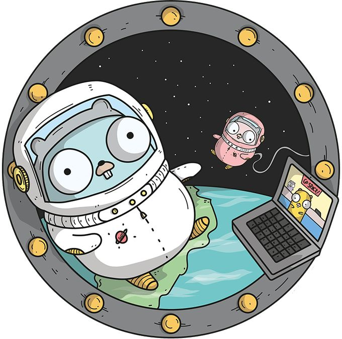

# Mini projects in Go
Here are some of the most common projects built in Go, helping you to discover more about the language, as well as sharpening your skills if you're a beginner. I'll be adding these projects on daily basis, from beginner to advance.  

## Let's Go!

### List of Projects:

* URL-shortener
  
  This is a simple URL shortener service built using Go. It allows you to create shortened URLs for long web addresses, making them easier to share and manage.

* Movies CRUD API
  
  A lightweight Go-based RESTful API for managing a movie database with full CRUD operations using Gorilla Mux router.

* Egg Timer

  A visually engaging egg timer app built with Go and Gio UI that displays an animated egg changing from white to yellow as your cooking timer progresses.

* QR Code Generator
  
  A simple Go command-line tool that converts text input into PNG QR code images.

* Simple URL Scraper
  
  A concurrent web crawler that extracts all unique URLs from specified web pages.

* CLI Text Editor

  A minimalist command-line tool that allows users to view and edit text files through a straightforward terminal interface.
