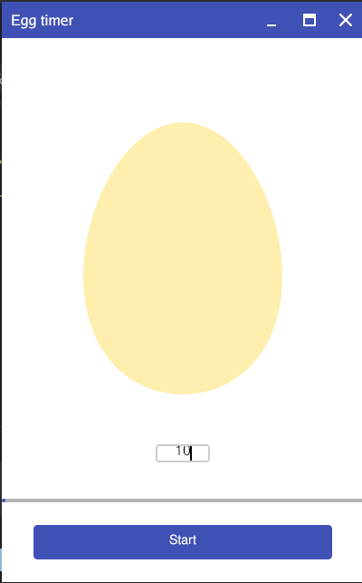

# Egg Timer 🥚

A visually appealing, minimalist egg timer application built with Go and the Gio UI toolkit. This timer features an animated egg that changes color as time progresses, a customizable timer duration, and a clean user interface.



## ✨ Features

-  Interactive egg visualization that changes color from white to yellow as the timer progresses
-  Customizable timer duration in seconds
-  Progress bar showing elapsed time
-  Simple start/stop controls
-  Smooth animations at 25 FPS
-  Cross-platform compatibility (runs on Windows, macOS, Linux)

## 📋 Requirements

- Go 1.16 or higher
-  Gio UI library (`gioui.org`)

## 🚀 Installation

### Prerequisites

Make sure you have Go installed on your system. If not, download and install it from [golang.org](https://golang.org/dl/).

### Steps

1.  Clone this repository:
   ```bash
   git clone https://github.com/yourusername/gio-egg-timer.git
   cd gio-egg-timer
   ```

2. Install the required dependencies:
   ```bash
   go get -u gioui.org
   ```

3.  Build the application:
   ```bash
   go build
   ```

## 📝 Usage

1.  Run the application:
   ```bash
   ./gio-egg-timer
   ```

2.  Enter the desired boiling time in seconds in the input field
3.  Click the "Start" button to begin the timer
4.  The egg will gradually change color from white to yellow as time progresses
5.  Click the "Stop" button to pause the timer if needed
6.  When the timer completes, the button will display "Finished"

## ⚙️ How It Works

The application consists of several key components:

-  A main timer goroutine that updates the progress at 25 FPS
-  A custom egg shape drawn using Gio's vector graphics capabilities
-  A text input field for timer duration
-  A progress bar showing elapsed time
-  A start/stop button that changes text based on the timer state

The egg color transitions from white (raw) to yellow (boiled) based on the timer progress, providing a visual representation of the cooking process.


## 👥 Contributing

Contributions are welcome! Here's how you can contribute:

1.  Fork the repository
2.  Create a new branch (`git checkout -b feature/your-feature`)
3.  Make your changes
4.  Commit your changes (`git commit -m 'Add some feature'`)
5.  Push to the branch (`git push origin feature/your-feature`)
6.  Open a Pull Request

## 📜 License

This project is licensed under the MIT License - see the [LICENSE](LICENSE) file for details.

## 🙏 Acknowledgments

-  The [Gio UI toolkit](https://gioui.org) for providing a modern, portable UI framework for Go
-  Inspiration from classic egg timer applications
